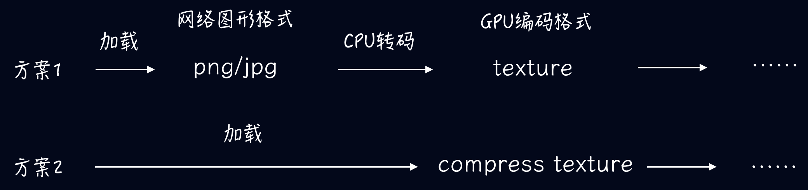
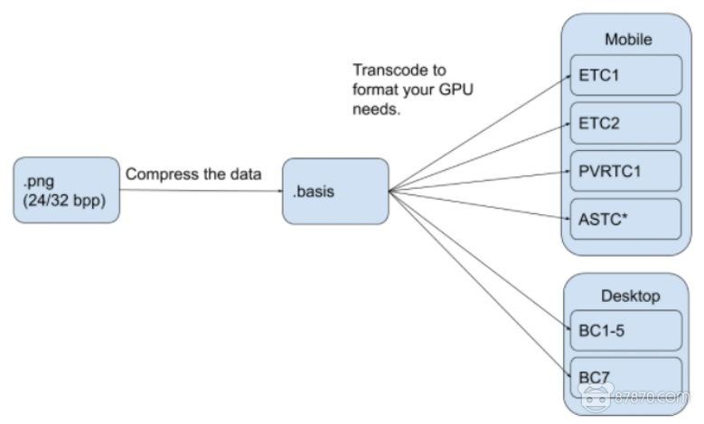

# 3D in Web

## Basis

### Mesh

#### 网格模型压缩

- 减面，减小几何体的大小，但同时会损失精度

  - 通过 [glTF](../doc/three.js/外部模型.md) 配合 Draco 压缩的方式，可以在视觉效果近乎一致的情况下，让 3D 模型文件成倍缩小

- Draco
  - Draco 通过 Edge breaker 3D 压缩算法改变了模型的网格数据的索引方法，缺少了原来的网格顺序
  - Draco 通过减少顶点坐标、顶点纹理坐标等信息的位数，以减少数据的存储量
  - 在 gltf-pipeline 或其他压缩工具中，压缩程度可通过设置参数进行调整

### Texture

#### Wrap

- 来源

#### FlipY

- Texture is flipped along the vertical axis when uploaded to the GPU

- 来源 - webGL 坐标系的 vertical axis 与一些图片的坐标系相反

#### 纹理绘制特点

- 图片数据的存储是从左上角开始的，即传入坐标 (0,0) 时，实际上会取到左上角坐标的值

  - 而现实视觉中坐标 (0,0) 对应的是左下角坐标
  - 可用 `FlipY` 翻转数据

- 如果纹理不是 2 的幂次方，程序一者是不支持，一者是软件处理成 2 的幂次方

#### 纹理大小计算

按位图计算

- 宽 \* 高 \* 位深度 \* (rgba)
- 一张尺寸为 512 \* 256 的位深度为 8 的 rgb 图，写入 GPU 的缓存是 512 \* 256 \* 8 \* 3

#### Max size supported by device

```js
const canvas = document.createElement('canvas')
const gl = canvas.getContext('webgl')
gl.getParameter(gl.MAX_TEXTURE_SIZE)
```

#### 纹理压缩 - Basis Universal

- Basis Universal is a "supercompressed" GPU texture data interchange system that supports two highly compressed intermediate file formats (.basis or the .KTX2 open standard from the Khronos Group) that can be quickly transcoded to a very wide variety of GPU compressed and uncompressed pixel formats

- 图片到 GPU 纹理过程
  

- Basis Universal 加载示意图
  

#### [THREE 纹理](../doc/three.js/纹理.md)

## Issues

## Engine

- [webgl](./webgl/README.MD)

- [three.js](./three.js/README.MD)

- [mind-ar.js](./mindar.js/README.MD)

- [ar.js](./AR.js/README.MD)
