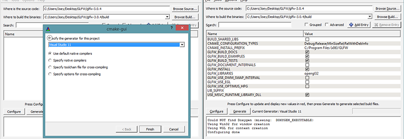
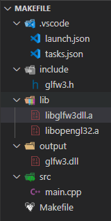

# OpenGL

## 基础

> 源于：<https://learnopengl-cn.github.io/>

### 环境搭建

- CMake
  > CMake是一个工程文件生成工具。用户可以使用预定义好的CMake脚本，根据自己的选择（像是Visual Studio, Code::Blocks, Eclipse）生成不同IDE的工程文件

- 窗口
  - 创建OpenGL上下文(Context)和一个用于显示的窗口在每个系统上都是不一样的；需要自己处理创建窗口，定义OpenGL上下文以及处理用户输入
  - 最流行的几个库有 GLUT，SDL，SFML 和 GLFW

- GLFW
  > GLFW是一个专门针对OpenGL的C语言库，它提供了一些渲染物体所需的最低限度的接口。它允许用户创建OpenGL上下文，定义窗口参数以及处理用户输入
  - 下载源代码包：<http://www.glfw.org/download.html>
  - 只需要：编译生成的库 和 include文件夹

- GLAD
  > OpenGL只是一个标准/规范，具体的实现是由驱动开发商针对特定显卡实现的；由于OpenGL驱动版本众多，它大多数函数的位置都无法在编译时确定下来，需要在运行时查询；开发者需要在运行时获取函数地址并将其保存在一个函数指针中供以后使用；GLAD 库能简化此过程
  - 是一个在线服务 <http://glad.dav1d.de/>
    - 语言(Language)：C/C++
    - gl：3.3以上
    - Profile：Core
    - 生成加载器：是
  - 获取 zip 包

#### 基于 VS

- CMake 编译 GLFW 源码
  - 点击 Configure 选择 Visual Studio 版本

    
  - 点击 Generate 生成

#### 基于 VS Code

<https://www.cnblogs.com/zhong-dev/p/13859282.html>
<https://blog.csdn.net/sarono/article/details/86564726>

- MinGW
  - 下载离线包，解压，配置 path
  - 验证：gcc -v

- CMake 编译 GLFW 源码
  - 似上图，点击 Configure 选择 MinGW
  - 勾选 BUILD_SHARED_LIBS，点击 Generate 生成
  - 进入 build 目录，打开控制台，执行 mingw32-make 命令
  - 从 build/src 目录下得到 glfw3.dll，libglfw3dll.a 两个文件
  - 从 glfw-3.3.5\include\GLFW\ 获取 glfw3.h

- 配置 GLAD
  - 将 glad 编译成了静态库
  - 进入 glad 的目录（含有 include 和 src）

  ```sh
    gcc .\src\glad.c -c -I. \include\
    ar -rc libglad.a glad.o
  ```

  - 得到 glad.o 和 libglad.a 文件，libglad.a 是所需要的

- Vs Code OpenGL C++ 项目

  - 添加扩展 `C/C++ Project Generator`
    - Ctrl + Shift + P
    - Create c++ project
  - Makefile，更新 `LFLAGS = ./lib/libglfw3dll.a ./lib/libopengl32.a`

  - 项目结构树

    

    - libopengl32 在 mingw 中

  - Run - `mingw32-make run`

- `g++ main.cpp -o test libglfw3dll.a libopengl32.a`
