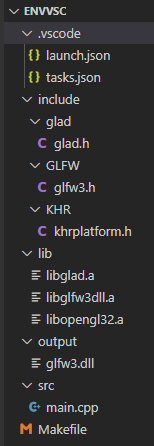

# OpenGL(3.3)

## 基础

> 源于：<https://learnopengl-cn.github.io/>

- 是 API，包含了一系列可以操作图形、图像的函数
- 是 一个由Khronos组织制定并维护的规范(Specification)

- 由于OpenGL的大多数实现都是由显卡厂商编写的，当产生一个bug时通常可以通过升级显卡驱动来解决
- OpenGL自身 是一个巨大的状态机(State Machine)：一系列的变量描述OpenGL此刻应当如何运行

- 核心模式与立即渲染模式
  - 立即渲染模式下，OpenGL的大多数功能都被库隐藏起来，开发者很少有控制OpenGL如何进行计算的自由，确实容易使用和理解，但是效率太低
  - OpenGL3.2开始，规范文档开始废弃立即渲染模式，并鼓励开发者在OpenGL的核心模式(Core-profile)下进行开发，这个分支的规范完全移除了旧的特性
  - 当使用OpenGL的核心模式时，OpenGL迫使我们使用现代的函数，现代函数要求使用者真正理解OpenGL和图形编程，提供了更多的灵活性，更高的效率
  - 所有OpenGL的更高的版本都是在3.3的基础上，引入了额外的功能，并没有改动核心架构

### 环境搭建

- CMake
  > CMake是一个工程文件生成工具。用户可以使用预定义好的CMake脚本，根据自己的选择（像是Visual Studio, Code::Blocks, Eclipse）生成不同IDE的工程文件

- 窗口
  - 创建OpenGL上下文(Context)和一个用于显示的窗口在每个系统上都是不一样的；需要自己处理创建窗口，定义OpenGL上下文以及处理用户输入
  - 最流行的几个库有 GLUT，SDL，SFML 和 GLFW

- GLFW
  > GLFW是一个专门针对OpenGL的C语言库，它提供了一些渲染物体所需的最低限度的接口。它允许用户创建OpenGL上下文，定义窗口参数以及处理用户输入
  - 下载源代码包：<http://www.glfw.org/download.html>
  - 只需要：编译生成的库 和 include文件夹

- GLAD
  > OpenGL只是一个标准/规范，具体的实现是由驱动开发商针对特定显卡实现的；由于OpenGL驱动版本众多，它大多数函数的位置都无法在编译时确定下来，需要在运行时查询；开发者需要在运行时获取函数地址并将其保存在一个函数指针中供以后使用；GLAD 库能简化此过程
  - 是一个在线服务 <http://glad.dav1d.de/>
    - 语言(Language)：C/C++
    - gl：3.3以上
    - Profile：Core
    - 生成加载器：是
  - 获取 zip 包

#### 基于 VS

- CMake 编译 GLFW 源码
  - 点击 Configure 选择 Visual Studio 版本

    
  - 点击 Generate 生成

#### 基于 VS Code

<https://www.cnblogs.com/zhong-dev/p/13859282.html>
<https://blog.csdn.net/sarono/article/details/86564726>

- MinGW
  - 下载离线包，解压，配置 path
  - 验证：gcc -v

- CMake 编译 GLFW 源码
  - 似上图，点击 Configure 选择 MinGW
  - 勾选 BUILD_SHARED_LIBS，点击 Generate 生成
  - 进入 build 目录，打开控制台，执行 mingw32-make 命令
  - 从 build/src 目录下得到 glfw3.dll，libglfw3dll.a 两个文件
  - 从 glfw-3.3.5\include\GLFW\ 获取 glfw3.h

- 配置 GLAD
  - 将 glad 编译成了静态库
  - 进入 glad 的目录（含有 include 和 src）

  ```sh
    gcc .\src\glad.c -c -I. \include\
    ar -rc libglad.a glad.o
  ```

  - 得到 glad.o 和 libglad.a 文件，libglad.a 是所需要的

- Vs Code OpenGL C++ 项目

  - 添加扩展 `C/C++ Project Generator`
    - Ctrl + Shift + P
    - Create c++ project

  - libopengl32 在 mingw 中

  - 2.0
    - main.cpp

      ```cpp
        #include <GL/gl.h>
        #include "glfw3.h"
      ```

    - Makefile，更新 `LFLAGS = ./lib/libglfw3dll.a ./lib/libopengl32.a`

    - 项目结构树

      

  - 3.3
    - main.cpp

    ```cpp
      #include <glad/glad.h>
      #include <GLFW/glfw3.h>
    ```

    - Makefile，更新 `LFLAGS = ./lib/libglfw3dll.a ./lib/libopengl32.a ./lib/libglad.a`

    - 项目结构树

      

  - Run - `mingw32-make run`

- `g++ main.cpp -o test libglfw3dll.a libopengl32.a`

### 概念

- `图形渲染管线(Graphics Pipeline)`

  .png)

- `顶点着色器(Vertex Shader)`：是把3D坐标转为另一种3D坐标，同时允许我们对顶点属性进行一些基本处理
  - 例：`GL_POINTS`、`GL_TRIANGLES`、`GL_LINE_STRIP`
- `图元装配(Primitive Assembly)`：将顶点着色器输出的所有顶点作为输入（如果是GL_POINTS，那么就是一个顶点），并所有的点装配成指定图元的形状
  - `图元(Primitive)`：基本图形元素是任何一个图形表达都是由若干不同的点、线、面图案或相同的图案循环组合而成的。这些点、线、面图案即为基本图形元素
- `几何着色器(Geometry Shader)`：可以通过产生新顶点构造出新的（或是其它的）图元来生成其他形状
- `裁切(Clipping)`：裁切会丢弃超出你的视图以外的所有像素，用来提升执行效率
- `光栅化阶段(Rasterization Stage)`：会把图元映射为最终屏幕上相应的像素，生成供片段着色器(Fragment Shader)使用的片段(Fragment)
  - `片段(Fragment)`：OpenGL中的一个片段是OpenGL渲染一个像素所需的所有数据
- `片段着色器(Fragment Shader)`：主要目的是计算一个像素的最终颜色，这也是所有OpenGL高级效果产生的地方

- `标准化设备坐标(Normalized Device Coordinates, NDC)`：一旦你的顶点坐标已经在顶点着色器中处理过，它们就应该是标准化设备坐标了，标准化设备坐标是一个x、y和z值在-1.0到1.0的一小段空间。任何落在范围外的坐标都会被丢弃/裁剪，不会显示在你的屏幕上
  - 标准化设备坐标接着会变换为屏幕空间坐标(Screen-space Coordinates)，这是使用你通过glViewport函数提供的数据，进行视口变换(Viewport Transform)完成的。所得的屏幕空间坐标又会被变换为片段输入到片段着色器中
- 深度：可以理解为z坐标，它代表一个像素在空间中和你的距离，如果离你远就可能被别的像素遮挡，你就看不到它了，它会被丢弃，以节省资源
- 视口(Viewport)：渲染窗口的尺寸大小

### 简易流程

- 使用glGenBuffers函数和一个缓冲ID生成一个VBO对象
- 使用glBindBuffer函数把新创建的缓冲绑定到GL_ARRAY_BUFFER目标
  - 顶点缓冲对象的缓冲类型是GL_ARRAY_BUFFER，OpenGL允许我们同时绑定多个缓冲，只要它们是不同的缓冲类型
- 调用glBufferData函数，它会把之前定义的顶点数据复制到缓冲的内存中

### Example

```cpp
#include <glad/glad.h>
#include <GLFW/glfw3.h>

#include <iostream>

void framebuffer_size_callback(GLFWwindow* window, int width, int height);
void processInput(GLFWwindow *window);

// settings
const unsigned int SCR_WIDTH = 800;
const unsigned int SCR_HEIGHT = 600;

const char *vertexShaderSource = "#version 330 core\n"
    "layout (location = 0) in vec3 aPos;\n"
    "void main()\n"
    "{\n"
    "   gl_Position = vec4(aPos.x, aPos.y, aPos.z, 1.0);\n"
    "}\0";
const char *fragmentShaderSource = "#version 330 core\n"
    "out vec4 FragColor;\n"
    "void main()\n"
    "{\n"
    "   FragColor = vec4(1.0f, 0.5f, 0.2f, 1.0f);\n"
    "}\n\0";

int main()
{
    // glfw: initialize and configure
    // ------------------------------
    glfwInit();
    glfwWindowHint(GLFW_CONTEXT_VERSION_MAJOR, 3); // OpenGL 主版本号
    glfwWindowHint(GLFW_CONTEXT_VERSION_MINOR, 3); // OpenGL 次版本号
    glfwWindowHint(GLFW_OPENGL_PROFILE, GLFW_OPENGL_CORE_PROFILE); // 使用核心模式(Core-profile) 

#ifdef __APPLE__ // 如果使用的是Mac OS X系统
    glfwWindowHint(GLFW_OPENGL_FORWARD_COMPAT, GL_TRUE);
#endif

    // glfw window creation
    // --------------------
    GLFWwindow* window = glfwCreateWindow(SCR_WIDTH, SCR_HEIGHT, "LearnOpenGL", NULL, NULL);
    if (window == NULL)
    {
        std::cout << "Failed to create GLFW window" << std::endl;
        glfwTerminate();
        return -1;
    }
    glfwMakeContextCurrent(window);
    // 每当窗口调整大小时回调
    glfwSetFramebufferSizeCallback(window, framebuffer_size_callback);

    // glad: load all OpenGL function pointers
    // ---------------------------------------
    // glfwGetProcAddress，根据我们编译的系统定义了正确的函数
    if (!gladLoadGLLoader((GLADloadproc)glfwGetProcAddress))
    {
        std::cout << "Failed to initialize GLAD" << std::endl;
        return -1;
    }


    // build and compile our shader program
    // ------------------------------------
    // vertex shader
    unsigned int vertexShader = glCreateShader(GL_VERTEX_SHADER);
    glShaderSource(vertexShader, 1, &vertexShaderSource, NULL);
    glCompileShader(vertexShader);
    // check for shader compile errors
    int success;
    char infoLog[512];
    glGetShaderiv(vertexShader, GL_COMPILE_STATUS, &success);
    if (!success)
    {
        glGetShaderInfoLog(vertexShader, 512, NULL, infoLog);
        std::cout << "ERROR::SHADER::VERTEX::COMPILATION_FAILED\n" << infoLog << std::endl;
    }
    // fragment shader
    unsigned int fragmentShader = glCreateShader(GL_FRAGMENT_SHADER);
    glShaderSource(fragmentShader, 1, &fragmentShaderSource, NULL);
    glCompileShader(fragmentShader);
    // check for shader compile errors
    glGetShaderiv(fragmentShader, GL_COMPILE_STATUS, &success);
    if (!success)
    {
        glGetShaderInfoLog(fragmentShader, 512, NULL, infoLog);
        std::cout << "ERROR::SHADER::FRAGMENT::COMPILATION_FAILED\n" << infoLog << std::endl;
    }
    // link shaders
    unsigned int shaderProgram = glCreateProgram();
    glAttachShader(shaderProgram, vertexShader);
    glAttachShader(shaderProgram, fragmentShader);
    glLinkProgram(shaderProgram);
    // check for linking errors
    glGetProgramiv(shaderProgram, GL_LINK_STATUS, &success);
    if (!success) {
        glGetProgramInfoLog(shaderProgram, 512, NULL, infoLog);
        std::cout << "ERROR::SHADER::PROGRAM::LINKING_FAILED\n" << infoLog << std::endl;
    }
    glDeleteShader(vertexShader);
    glDeleteShader(fragmentShader);

    // set up vertex data (and buffer(s)) and configure vertex attributes
    // ------------------------------------------------------------------
    float vertices[] = {
        -0.5f, -0.5f, 0.0f, // left  
         0.5f, -0.5f, 0.0f, // right 
         0.0f,  0.5f, 0.0f  // top   
    }; 

    unsigned int VBO, VAO;
    glGenVertexArrays(1, &VAO);
    glGenBuffers(1, &VBO);
    // bind the Vertex Array Object first, then bind and set vertex buffer(s), and then configure vertex attributes(s).
    glBindVertexArray(VAO);

    glBindBuffer(GL_ARRAY_BUFFER, VBO);
    glBufferData(GL_ARRAY_BUFFER, sizeof(vertices), vertices, GL_STATIC_DRAW);

    glVertexAttribPointer(0, 3, GL_FLOAT, GL_FALSE, 3 * sizeof(float), (void*)0);
    glEnableVertexAttribArray(0);

    // note that this is allowed, the call to glVertexAttribPointer registered VBO as the vertex attribute's bound vertex buffer object so afterwards we can safely unbind
    glBindBuffer(GL_ARRAY_BUFFER, 0); 

    // You can unbind the VAO afterwards so other VAO calls won't accidentally modify this VAO, but this rarely happens. Modifying other
    // VAOs requires a call to glBindVertexArray anyways so we generally don't unbind VAOs (nor VBOs) when it's not directly necessary.
    glBindVertexArray(0); 


    // uncomment this call to draw in wireframe polygons.
    //glPolygonMode(GL_FRONT_AND_BACK, GL_LINE);

    // render loop
    // -----------
    // glfwWindowShouldClose函数在循环前检查GLFW是否被要求退出，若是则该函数返回true
    while (!glfwWindowShouldClose(window))
    {
        // input
        // -----
        processInput(window);

        // render
        // ------
        glClearColor(0.2f, 0.3f, 0.3f, 1.0f);
        glClear(GL_COLOR_BUFFER_BIT);

        // draw our first triangle
        glUseProgram(shaderProgram);
        glBindVertexArray(VAO); // seeing as we only have a single VAO there's no need to bind it every time, but we'll do so to keep things a bit more organized
        glDrawArrays(GL_TRIANGLES, 0, 3);
        // glBindVertexArray(0); // no need to unbind it every time 

        // glfw: swap buffers and poll IO events (keys pressed/released, mouse moved etc.)
        // -------------------------------------------------------------------------------
        // glfwSwapBuffers函数会交换颜色缓冲（它是一个储存着GLFW窗口每一个像素颜色值的大缓冲），它在这一迭代中被用来绘制，并且将会作为输出显示在屏幕上
        /*
        *  应用程序使用单缓冲绘图时可能会存在图像闪烁的问题。 这是因为生成的图像不是一下子被绘制出来的，而是按照从左到右，由上而下逐像素地绘制而成的。
        *  最终图像不是在瞬间显示给用户，而是通过一步一步生成的，这会导致渲染的结果很不真实
        *  双缓冲(Double Buffer): 前缓冲保存着最终输出的图像，它会在屏幕上显示；而所有的的渲染指令都会在后缓冲上绘制。当所有的渲染指令执行完毕后，
        *  我们交换(Swap)前缓冲和后缓冲
        */
        glfwSwapBuffers(window);
        // glfwPollEvents 函数检查有没有触发什么事件（比如键盘输入、鼠标移动等）、更新窗口状态，并调用对应的回调函数（可以通过回调方法手动设置）
        glfwPollEvents();
    }

    // optional: de-allocate all resources once they've outlived their purpose:
    // ------------------------------------------------------------------------
    glDeleteVertexArrays(1, &VAO);
    glDeleteBuffers(1, &VBO);
    glDeleteProgram(shaderProgram);

    // glfw: terminate, clearing all previously allocated GLFW resources.
    // ------------------------------------------------------------------
    // 释放/删除之前的分配的所有资源
    glfwTerminate();
    return 0;
}

// process all input: query GLFW whether relevant keys are pressed/released this frame and react accordingly
// ---------------------------------------------------------------------------------------------------------
void processInput(GLFWwindow *window)
{
    if (glfwGetKey(window, GLFW_KEY_ESCAPE) == GLFW_PRESS)
        glfwSetWindowShouldClose(window, true);
}

// glfw: whenever the window size changed (by OS or user resize) this callback function executes
// ---------------------------------------------------------------------------------------------
void framebuffer_size_callback(GLFWwindow* window, int width, int height)
{
    // make sure the viewport matches the new window dimensions; note that width and 
    // height will be significantly larger than specified on retina displays.
    glViewport(0, 0, width, height);
}
```

### 注意点

- 从CPU把数据发送到显卡相对较慢，所以只要可能我们都要尝试尽量一次性发送尽可能多的数据

### 函数

#### `Shader`

- glCreateShader(GL_VERTEX_SHADER);
- glShaderSource(vertexShader, 1, &vertexShaderSource, NULL);
  - 第二参数指定了传递的源码字符串数量
- glCompileShader(vertexShader);
  - glGetShaderiv(vertexShader, GL_COMPILE_STATUS, &success)
    - 检测在调用glCompileShader后编译是否成功
    - int  success;
  - glGetShaderInfoLog(vertexShader, 512, NULL, infoLog);
    - 获取消息
    - char infoLog[512];

#### `Program`

- shaderProgram = glCreateProgram();
- glAttachShader(shaderProgram, vertexShader);
- glLinkProgram(shaderProgram);
  - glGetProgramiv(shaderProgram, GL_LINK_STATUS, &success);
  - glGetProgramInfoLog(shaderProgram, 512, NULL, infoLog)

- glUseProgram(shaderProgram);
- glDeleteShader(vertexShader);

#### `Buffer`

- glGenBuffers(1, &VBO);
- glBindBuffer(GL_ARRAY_BUFFER, VBO);
- glBufferData(GL_ARRAY_BUFFER, sizeof(vertices), vertices, GL_STATIC_DRAW);
  - GL_STATIC_DRAW ：数据不会或几乎不会改变
  - GL_DYNAMIC_DRAW：数据会被改变很多
  - GL_STREAM_DRAW ：数据每次绘制时都会改变

#### `Pointer`

- glVertexAttribPointer(0, 3, GL_FLOAT, GL_FALSE, 3 *sizeof(float), (void*)0);

#### `Vertex Array Object`

- glBindVertexArray(VAO);
- glEnableVertexAttribArray(0);
- glDisableVertexAttribArray [?]

#### `Viewport`

- glViewport(0, 0, 800, 600);
  - 设置窗口的维度
  - 前两个参数控制窗口左下角的位置。第三个和第四个参数控制渲染窗口的宽度和高度（像素）

#### Status

- 状态设置函数
  - glClearColor(0.3f, 0.4f, 0.4f, 1.0f);
    - 设置清空屏幕所用的颜色

- 状态使用函数
  - glClear(GL_COLOR_BUFFER_BIT)