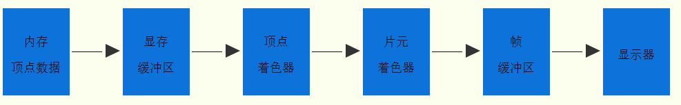
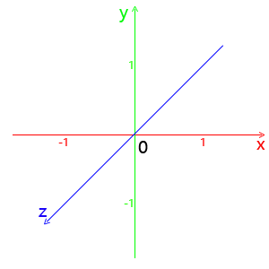

# WebGL

- 简述

  - WebGL 引入了一个与 OpenGL ES 2.0 非常一致的 API
  - WebGL 2 API 引入了对大部分的 OpenGL ES 3.0 功能集的支持

- 渲染管线流程图


- Example

```html
<!DOCTYPE html>
  <head>
    <title>Draw a point by webgl</title>
  </head>
  <body>
    <canvas id="webgl" width="500" height="500" style="background-color: blue;"></canvas>
    <script>
      const canvas = document.getElementById('webgl'); // 获取 canvas
      const gl = canvas.getContext('webgl'); // 获取 webgl

      // 顶点着色器源码
      const vertexShaderSource = '' +
        'void main() {' +
        //给内置变量gl_PointSize赋值像素大小
        '   gl_PointSize = 20.0;' +
        //顶点位置，位于坐标原点
        '   gl_Position = vec4(0.0, 0.0, 0.0, 1.0);' +
        '}';
      // 片元着色器源码
      const flagShaderSource = '' +
        'void main() {' +
        //定义片元颜色
        '   gl_FragColor = vec4(1.0, 0.0 ,0.0, 1.0);' +
        '}';

      // 初始化着色器
      // 创建着色器对象
      const vertexShader = gl.createShader(gl.VERTEX_SHADER); // 创建顶点着色器对象
      const fragShader = gl.createShader(gl.FRAGMENT_SHADER); // 创建片元着色器
      // 引入着色器源码
      gl.shaderSource(vertexShader, vertexShaderSource); // 向顶点着色器引入源码
      gl.shaderSource(fragShader, fragShaderSource); // 向片元着色器引入源码
      // 编译着色器
      gl.compileShader(vertexShader); // 编译顶点着色器
      gl.compileShader(fragShader); // 编译片元着色器
      // 创建程序对象程序对象
      const program = gl.createProgram();
      // 附着着色器到程序对象
      gl.attachShader(program, vertexShader); // 附着顶点着色器到程序对象
      gl.attachShader(program, fragShader); // 附着片元着色器到程序对象
      // 链接程序对象
      gl.linkProgram(program);
      // 使用程序对象
      gl.useProgram(program);

      // 开始绘制，显示器显示结果
      gl.drawArrays(gl.POINTS, 0, 1);
    </script>
  </body>
</html>
```

- `attribute` 关键字

  - 目的是为了 javascript 可以调用相关的 WebGL API 把顶点相关数据从 javascript 传递给顶点着色器 attribute 声明的变量

  - 声明变量

  ```js
  const vertexShader = `
    attribute vec4 apos;
    void main () {
      gl_Position = apos;
    }
  `
  ```

  - 使用变量

  ```js
  const data = new Float32Array([0.5, 0.5, 0.5, -0.5, -0.5, -0.5, -0.5, 0.5])
  // 获取顶点着色器的位置变量 apos
  const aposLocation = gl.getAttribLocation(program, 'apos')
  // 创建显存缓冲区对象
  const buffer = gl.createBuffer()
  // 绑定缓冲区对象，激活缓冲区对象
  // target: number, buffer: WebGLBuffer
  gl.bindBuffer(gl.ARRAY_BUFFER, buffer)
  // 顶点数组 data 数据传入显卡缓冲区
  // target, size, usage
  // target, ArrayBuffer? srcData, usage
  gl.bufferData(gl.ARRAY_BUFFER, data, gl.STATIC_DRAW)
  // 缓冲区内的数据按照规律传递给位置变量 apos
  // index, size, type, normalized, stride, offset
  gl.vertexAttribPointer(aposLocation, 2, gl.FLOAT, false, 0, 0)
  // 允许数据传递
  gl.enableVertexAttribArray(aposLocation)
  ```

- `drawArrays` 整体执行顺序

  - 

## Basis

### WebGL 坐标系—投影

- canvas 画布宽高采用的是像素值定义，以显示器为准，WebGL 中顶点坐标的表示方法采用的是相对坐标，相对于 canvas 而言 WebGL 坐标系统，X 轴水平向右，也就是 canvas 画布的 width 表示的宽度方向
- WebGL 坐标系统，Y 轴竖直向上，也就是 canvas 画布的 height 表示的高度方向
- WebGL 坐标系统，Z 轴垂直 canvas 画布朝外
- WebGL 坐标系统坐标都限制在 -1.0~1.0 范围内，超出范围的会被剪裁掉
  - 
